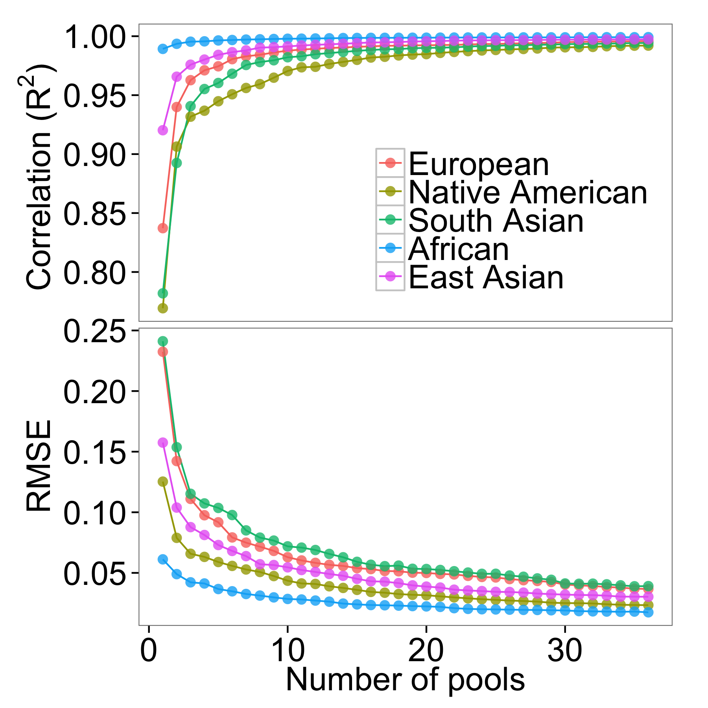

# ANTseq

## Ancestry Inference through Microfluidic Multiplex PCR and Sequencing

Introduction 
-------------
ANTseq is a pipeline to determine the ancestral origins of DNA samples.  

ANTseq uses [microfluidic multiplex PCR and sequencing](http://www.nature.com/nmeth/journal/v11/n1/full/nmeth.2736.html)(mmPCR-seq) to determine the genotypes at specific genetic loci called Ancestry Informative Markers (AIMs). Genotypes at these loci are subsequently used to estimate the ancestral composition using a likelihood framework. 

Ancestry determination has traditionally been done with microarrays or conventional PCR. Comapred to microarrays, ANTseq achieves comparable accuracy under the same amout of time, but cost less and is more flexible in selection of loci. This is accomplished by leveraging multi-population whole genome information from the 1000 Genomes consortium. Instead of genotyping 300,000+ loci like most microarrays do, ANTseq only requires dozens to hundreds of loci. Compared to conventional PCR, ANTseq achieves comparable or superior accuracy, but is faster and costs magnitudes less by leveraging mmPCR-seq.

Download
---------

We provide AIMs sets for 
  1. Five-way comparisons of major continental populations (African, European, South Asian, East Asian and Native American) 
  2. Pairwise comparisons of four continental populations (African, European, South Asian, East Asian)
  3. A three-way comparison for Admixed Americans. Native Americans are ad-mixed with Europeans and Africans; the three-way configuration is more applicable in most cases than two separate pairwise comparisons. 
  
[Download primers](_download/primerPools)

Installation 
-------------
To use ANTseq, first download this repository. ANTseq makes use of Python 2.7, numpy and scipy. You can either install the [Anaconda](https://store.continuum.io/cshop/anaconda/) distribution of Python (which includes numpy and scipy) or install these two modules manually. In addition, ANTseq uses [yamPCR](http://arep.med.harvard.edu/kzhang/polHap/PrimerDesign.html) to design multiplex primer pools. The easiest way to install yamPCR dependencies is to use [cpanminus](http://search.cpan.org/~miyagawa/App-cpanminus-1.7039/lib/App/cpanminus.pm). In addition, you should install [VCFtools](http://vcftools.sourceforge.net/), [PLINK2](https://www.cog-genomics.org/plink2) and [ADMIXTURE](https://www.genetics.ucla.edu/software/admixture/) and add them to your PATH.

Instructions
--------
The instructions here is specific to five-way comparison of major continental populations. You may adapt this to your own purpose by changing the ancestral populations. For most cases, we recommend downloading the predesigned primers and skip steps 1-7.   

### Step 1: 

Download the 1000 Genomes genotype data and panel file:

```
for i in $(seq 1 22); do
  wget ftp://ftp.1000genomes.ebi.ac.uk/vol1/ftp/release/20130502/ALL.chr$i.phase3_shapeit2_mvncall_integrated_v5.20130502.genotypes.vcf.gz
done 

wget ftp://ftp.1000genomes.ebi.ac.uk/vol1/ftp/release/20130502/integrated_call_samples_v3.20130502.ALL.panel
```

### Step 2:

Filter out variants with global allele frequency less than 0.05. These variants are unlikely to be informative for ancestry inference so we filter them out to speed up downstream computation.

```
for i in {1..22}; do
  vcftools --gzvcf ALL.chr$i.phase3_shapeit2_mvncall_integrated_v5.20130502.genotypes.vcf.gz --recode --recode-INFO-all --maf 0.05 --stdout | gzip -c > ALL.chr$i.phase3_shapeit2_mvncall_integrated_v5.20130502.genotypes.maf05.vcf.gz
done 

vcf-concat ALL.chr{1..22}.phase3_shapeit2_mvncall_integrated_v5.20130502.genotypes.vcf.gz | gzip -c > ALL.autosome.phase3_shapeit2_mvncall_integrated_v5.20130502.genotypes.maf05.vcf.gz
```

### Step 3:
Calculate allele frequencies of five continental populations. We obtain allele frequency from 1000 Genomes for East Asian, South Asian and Europeans. 

```
for pop in {EAS,SAS,EUR}; do
  pop_file="$pop.pop"
  cat integrated_call_samples_v3.20130502.ALL.panel | grep $pop | awk '{print $1, $1, $2}' > $pop_file
  plink --vcf ALL.autosome.phase3_shapeit2_mvncall_integrated_v5.20130502.genotypes.maf05.vcf.gz --double-id --snps-only --freq --make-bed --keep-allele-order --keep $pop_file --out $pop
done 
```

For Africans, we remove African American in SW USA and African Caribbeans in Barbados before calculating allele frequency.
```
pop='AFR-ACB-ASW'
pop_file="$pop.pop"
cat $panel | grep AFR | grep -v ASW | grep -v ACB | awk '{print $1, $1, $2}' > $pop_file
plink --vcf ALL.autosome.phase3_shapeit2_mvncall_integrated_v5.20130502.genotypes.maf05.vcf.gz --double-id --snps-only --freq --make-bed --keep-allele-order --keep $pop_file --out $pop 
```

For Native Americans, we infer frequency using ADMIXTURE.
```
# make bed, bim and fam files: 
plink --vcf ALL.autosome.phase3_shapeit2_mvncall_integrated_v5.20130502.genotypes.maf05.vcf.gz --double-id --snps-only --make-bed --keep-allele-order --out ALL.autosome.phase3_shapeit2_mvncall_integrated_v5.20130502.genotypes.maf05 

# infer allele frequencies: 
admixture ALL.autosome.phase3_shapeit2_mvncall_integrated_v5.20130502.genotypes.maf05.bed 5
```

ADMIXTURE will output 2 files: ALL.autosome.phase3_shapeit2_mvncall_integrated_v5.20130502.genotypes.maf05.5.{P,Q}. The P file contains allele frequencies of the 5 populations. Each row of the P file represent a locus, and each column represent a population. The rows are in the same order as the input VCF, but the columns may be shuffled. You can infer the column order by comparing the Q file (ancestry proportions) to the panel file. To use the inferred allele frequencies for step 5, you will need to reformat the P file into a PLINK frq file. 

Caveats: 

1. The SNP column entries in the frq files are not unique. This is because not all SNPs are assigned RS IDs. We recommend that you change the column to {chr}_{pos}. An example is given in update_SNP_id.sh
2. The frq file contains NA lines. This is because the VCF file from 1000 Genome Project very occasionally has missing genotypes. We recommend that you remove these NA lines. An example is provided in rm_NA.py 


### Step 4:

Calculate global LD R^2. To reduce file size, we only report variants within 2000 skbps of each other and with R^2 greater than 0.2:

```
plink --vcf ALL.autosome.phase3_shapeit2_mvncall_integrated_v5.20130502.genotypes.maf05.vcf.gz --double-id --snps-only --r2 --ld-window-kb 2000 --ld-window 99999999 --ld-window-r2 0.2 --make-bed --out global_r2_0.2_window_2000k
```

### Step 5:

Select AIMs markers to distinguish five continental populations using AIMs_generator.py. We provide an [example](AIMs_generator/aims_properties_five_superpopulations_with_heterogeneity_filter.txt) configuration file. We recommend using the In strategy (strategy=In) with 0% multi-population In markers (propmultiIn=0.0), and apply heterogeneity filter on South Asians (SAS.subpopulations=GIH,PJL,BEB,STU,ITU)


```
python AIMs_generator/AIMs_generator.py AIMs_generator/aims_properties_five_superpopulations_with_heterogeneity_filter.txt
```

AIMs_generator.py will output AFR_AMR_EAS_EUR_SAS_with_heterogeneity_filter.500k_500.aims.

### Step 6:

Design primer pools for AIMs selected in step 5. Each pool will contain 10 primer pairs. 


```
python run_yamPCR.py AFR_AMR_EAS_EUR_SAS_with_heterogeneity_filter.500k_500.aims 10 .
```

Note the "." at the end of the command - it sets our working directory to the current directory. 

run_yamPCR.py will output files named primerPools_*.txt. 

Next we add barcode adapters to each primer: 

```
for i in {1..36}; do
  cat primerPool_$i.txt | python $ancestry/scripts/add_adaptor.py > primerPool_$i.adaptor.txt
done 
```

### Step 7:

We want to know how closely the AIMs estimation matches the true ancestry proportions. The true ancestry proportions are calculated using all 1000 Genomes SNPs. 

```
ls -v primerPool_*.txt > primerPoolList.txt
python -u calc_ancestry_proportions.py -p AFR,AMR,EAS,EUR,SAS -l primerPoolList.txt
```

calc_ancestry_proportions.py will output AFR.AMR.EAS.EUR.SAS.cumPrimerPool_{1..36}.5.{P,Q}

Next we want to visualize the correlation between AIMs and genomic ancestry proportions. An example is provided in plot_r2_and_RMSE.5_way_AIMs_set.R

The resulting plot looks like: 




### Step 8:

Next we will purchase multiplex primers. Instead of demonstrating the five-way comparison, we will perform a simpler but similar pairwise comparison of Africans and Europeans. You only likely only need to purchase primers once. The volumn of primers you purchase will be sufficient for many iterations of this pipeline. 

Order oligo plates using any service you are comfortable with. Here we provide a example for [ThermoFisher/Invitrogen](https://www.thermofisher.com/order/catalog/en/US/adirect/lt?cmd=UploadDNAPlateGroupFile). We have filled out an example of 96-well sequence [template](_download/example_multiplex_primer_pool.xls) using the first 4 primer pools of AFR-EUR AIMs. This example produces a single plate of primers shown as follows. Every two rows belong to the same primer pool (e.g. row A and B belongs to primer pool 1; row A is the forward and row B is the reverse primer).  


Below are the parameters we used to order primers: 

Parameter     |  Value
------------- |---------------------------
Size          | 96-wells
Volume        | 360 ul
Scale         | 25 nmole
Purification  | Desalted
Buffer        | TE
Ship Format   | Ambient
Normaliztion  | Volumn and Concentration
Norm. Volume  | 80 ul
Norm. Conc.   | 50 uM
Pooling       | None


### Step 9: 
Microfluidic multiplex PCR (mmPCR) and sequencing: This step is documented extensively in our [paper](http://www.nature.com/nmeth/journal/v11/n1/full/nmeth.2736.html). Below briefly describes the workflow: 


1. Microfluidic multiplex PCR

Follow Fluidigm's [protocol](_download/aa-2-primer-qr-c1.pdf) to perform mmPCR.

2. Sample barcoding

Barcoding allows PCR product to be sequenced in a single batch. The sequencing product will be de-multiplexed using unique barcodes of each sample. We provide a set of [384 unique barcodes](_download/fluidigm_10bp_384_index.rc_barcodeprimer.txt).   

3. Sequencing 

Sequencing procedures can vary depending on the instruments available in your institution/company. We recommend using **single-end** sequencing of at least **75 bases**. This is because the location of the AIMs marker is designed to be within 75 bases from the start of the forward read. We recommend sequencing to 100X coverage to account for uneven amplification during the PCR procedure. 

### Step 10: 

Map and sort sequencing data: 

```
bwa mem -M -R '@RG\tID:group1\tSM:sample\tPL:illumina\tLB:lib1\tPU:unit1' hg19.fa sample.fq.gz > sample.sam
samtools view -uhbS sample.sam | samtools sort - sample.sorted
```

### Step 11:

Call variants using GATK: 

```
java -Xmx4g -jar GenomeAnalysisTK.jar \
  -T HaplotypeCaller \
  -R hg19.fa \
  --genotyping_mode DISCOVERY
  -I sample.sorted.bam \
  -L aims_list \
  –output_mode EMIT_ALL_SITES \
  -o sample.vcf
```

The flag -L aims_list restricts the caller to regions to AIMs loci. We provide an [example](_download/2popaims_wlrld2M_150.aims.snpinfo.bed) aims_list. 

### Step 12: 

We will use ADMIXTURE to estimate ancestry proportions. First we need to convert the genotypes from VCF to PLINK's bed format.

```
plink --vcf sample.vcf --double-id --snps-only --keep-allele-order --make-bed --out sample
```

To increase the accuracy of ancestry estimates, we enhance our dataset with 1000 Genomes African and European individuals. We provide an [example](_download/2popaims_wlrld2M_150.aims.snpinfo) aims_id_list for the second command.

```
cat integrated_call_samples_v3.20130502.ALL.panel | grep -e AFR -e EUR | awk '{print $1, $1, $2}' > AFR.EUR.pop

plink --vcf ALL.autosome.phase3_shapeit2_mvncall_integrated_v5.20130502.genotypes.maf05.vcf.gz --double-id --snps-only --keep-allele-order --keep AFR.EUR.pop --extract aims_id_list --make-bed --out AFR.EUR

plink --bfile AFR.EUR --bmerge sample --make-bed --out merged
```

Finally, we estimate ancestry proportions using ADMIXTURE:

```
admixture merged.bed 2 
```

The Q file from ADMIXTURE contains the ancestry coefficients. 


Citation
--------
Boxiang Liu, Suyash Shringarpure, Christopher Gignoux, Rui Zhang, Kevin S. Smith, Carlos D. Bustamante, Jin Billy Li, Douglas Vollrath, Stephen B. Montgomery (2016) ANTseq: Ancestry Inference through Microfluidic Multiplex PCR and Sequencing 


Contact
-------- 
Please contact us if you have any questions.
Boxiang Liu: bliu2@stanford.edu   
Stephen Montgomery: smontgom@stanford.edu  


<a href="#top">Back to top</a>
