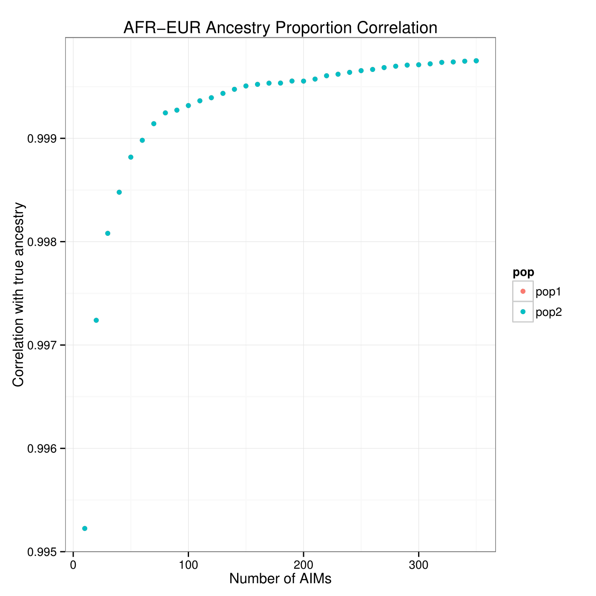
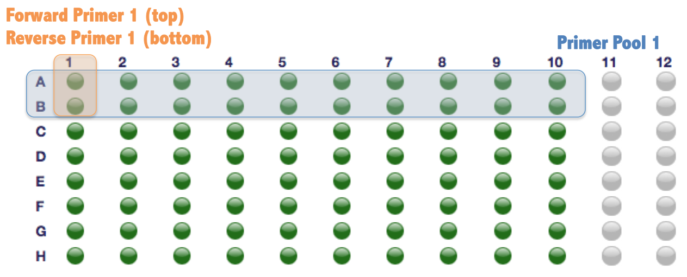
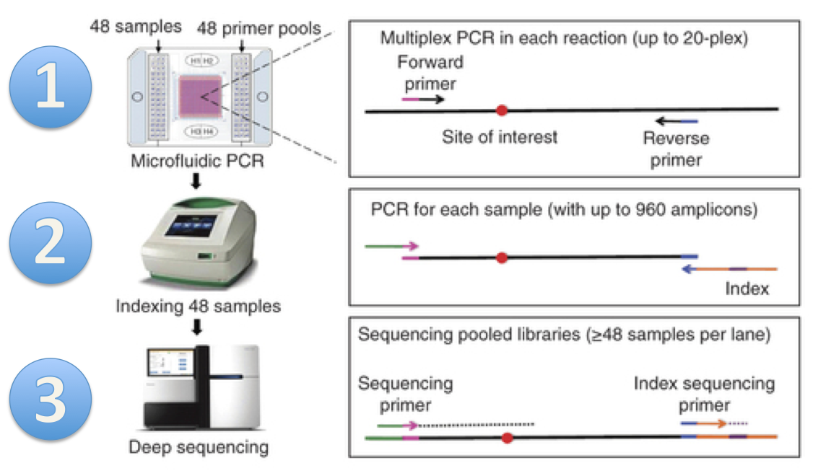

<center> <h1>ANTseq</h1> </center>

<center> <h3>Ancestry Inference through Microfluidic Multiplex PCR and Sequencing</h3> </center>

Introduction 
-------------
ANTseq is a pipeline to determine the ancestral origins of DNA samples.  

ANTseq uses [microfluidic multiplex PCR and sequencing](http://www.nature.com/nmeth/journal/v11/n1/full/nmeth.2736.html)(mmPCR-seq) to determine the genotypes at specific genetic loci called Ancestry Informative Markers (AIMs). Genotypes at these loci are subsequently used to estimate the ancestral composition using a likelihood framework. 

Ancestry determination has traditionally been done with microarrays or conventional PCR. Comapred to microarrays, ANTseq achieves comparable accuracy under the same amout of time, but cost less and is more flexible in selection of loci. This is accomplished by leveraging multi-population whole genome information from the 1000 Genomes consortium. Instead of genotyping 300,000+ loci like most microarrays do, ANTseq only requires dozens to hundreds of loci. Compared to conventional PCR, ANTseq achieves comparable or superior accuracy, but is faster and costs magnitudes less by leveraging mmPCR-seq.

Download
---------

We provide AIMs sets for 
  1. Five-way comparisons of major continental populations (African, European, South Asian, East Asian and Native American) 
  2. Pairwise comparisons of four continental populations (African, European, South Asian, East Asian)
  3. A three-way comparison for Admixed Americans. Native Americans are ad-mixed with Europeans and Africans; the three-way configuration is more applicable in most cases than two separate pairwise comparisons. 
  
[Download primers](https://github.com/boshliu/ANTseq/raw/gh-pages/_download/primerPools)

Installation 
-------------
To use ANTseq, you need to download the [repository](https://github.com/boxiangliu/ANTseq/). ANTseq makes use of Python 2.7, numpy and scipy. You can either install the [Anaconda](https://store.continuum.io/cshop/anaconda/) distribution of Python (which includes numpy and scipy) or install these two modules manually. In addition, ANTseq uses [yamPCR](http://arep.med.harvard.edu/kzhang/polHap/PrimerDesign.html) to design multiplex primer pools. The easiest way to install yamPCR dependencies is to use [cpanminus](http://search.cpan.org/~miyagawa/App-cpanminus-1.7039/lib/App/cpanminus.pm). In addition, you should install [VCFtools](http://vcftools.sourceforge.net/), [PLINK2](https://www.cog-genomics.org/plink2) and [ADMIXTURE](https://www.genetics.ucla.edu/software/admixture/) and add them to your PATH.

Instructions
--------
The instructions here is specific to five-way comparison of major continental populations. You may adapt this to your own purpose by changing the ancestral populations.  

### Step 1: 

Download the 1000 Genomes genotype data and panel file:

```
for i in $(seq 1 22); do
  wget ftp://ftp.1000genomes.ebi.ac.uk/vol1/ftp/release/20130502/ALL.chr$i.phase3_shapeit2_mvncall_integrated_v5.20130502.genotypes.vcf.gz
done 

wget ftp://ftp.1000genomes.ebi.ac.uk/vol1/ftp/release/20130502/integrated_call_samples_v3.20130502.ALL.panel
```

### Step 2:

Filter out variants with global allele frequency less than 0.05. These variants are unlikely to be informative for ancestry inference so we filter them out to speed up downstream computation.

```
for i in {1..22}; do
  vcftools --gzvcf ALL.chr$i.phase3_shapeit2_mvncall_integrated_v5.20130502.genotypes.vcf.gz --recode --recode-INFO-all --maf 0.05 --stdout | gzip -c > ALL.chr$i.phase3_shapeit2_mvncall_integrated_v5.20130502.genotypes.maf05.vcf.gz
done 

vcf-concat ALL.chr{1..22}.phase3_shapeit2_mvncall_integrated_v5.20130502.genotypes.vcf.gz | gzip -c > ALL.autosome.phase3_shapeit2_mvncall_integrated_v5.20130502.genotypes.maf05.vcf.gz
```

### Step 3:
Calculate allele frequencies of five continental populations. 

```
for pop in {AFR,EUR}; do
  pop_file="$pop.pop"
  cat integrated_call_samples_v3.20130502.ALL.panel | grep $pop | awk '{print $1, $1, $2}' > $pop_file
  plink --vcf ALL.autosome.phase3_shapeit2_mvncall_integrated_v5.20130502.genotypes.maf05.vcf.gz --double-id --snps-only --freq --make-bed --keep-allele-order --keep $pop_file --out $pop
done 
```

### Step 4:

Calculate global LD r2. Report r2 only when variants are within 2000kbps of each other and has r2 greater than 0.2:

```
plink --vcf ALL.autosome.phase3_shapeit2_mvncall_integrated_v5.20130502.genotypes.maf05.vcf.gz --double-id --snps-only --r2 --ld-window-kb 2000 --ld-window 99999999 --ld-window-r2 0.2 --make-bed --out global_r2_0.2_window_2000k
```

### Step 5:

Select AIMs markers optimized to distinguish Europeans from Africans:

First populate aims_properties.txt with pathes to AFR.frq and EUR.frq, an example can be found here: 
**TODO: make an example aims_properties.txt file**

Next run AIMs_generator.py:

```
python AIMs_generator.py aims_properties.txt 
```

### Step 6:

Design primer pools for AIMs in step 5. Each pool will contain 10 primer pairs. 

**Warning: the step may take quite some time (1-2 days based on our experience)!**

```
python run_yamPCR.py AFR_EUR_500k_500.aims 10 <path/to/output/dir>
```

You will end up with files named primerPools_*.txt in your output_directory. 

Next we add barcode adapters to each primer: 

```
cat primerPools_1.txt | python add_adaptor.py > primerPools_1.adaptor.txt
```

Note: download pre-designed multiplex primer pools [here](https://github.com/boshliu/ANTseq/raw/gh-pages/_download/primerPools)

### Step 7:

We want to know how closely the AIMs estimation matches the true ancestry proportions. The true ancestry proportions are calculated using all 1000 Genomes SNPs. 

```
ls -v primerPool_*.txt > primerPoolList.txt
calc_ancestry_proportions.py -p AFR,EUR -l primerPoolList.txt
```

### Step 8:

Visualize the correlation between AIMs estimation and true ancestry proportions. Here we assume 35 primer pools are designed: 

```
Rscript plot_ancestry_r2_vs_num_AIMs.r AFR,EUR 35
```

The resulting plot looks like: 

<p align="center">
  
<p/>

It is clear that AIMs in the first 7 pools is able to achieve greater than 0.999 correlation with the true ancestry proportions. However, since some primer pairs fail during PCR, you may want to double the number and use the first 15 primer pools.

### Step 9:

Purchase multiplex primers 

*Note: You only need to perform this step once. The volumn of primers you purchase in this step will be sufficient for many iterations of this pipeline*

Order oligo plates using any service you are comfortable with. Here we provide a example for [ThermoFisher/Invitrogen](https://www.thermofisher.com/order/catalog/en/US/adirect/lt?cmd=UploadDNAPlateGroupFile). We have filed out an example of [96-well sequence template](https://github.com/boshliu/ANTseq/raw/gh-pages/_examples/example_multiplex_primer_pool.xls) using the first 4 primer pools of AFR-EUR AIMs. This example produces a single plate of primers shown as follows: 



Below are the parameters we use: 

Parameter       Value
-----------   ----------
Size           96-wells
Volume         360 ul
Scale          25 nmole
Purification   Desalted
Buffer         TE
Ship Format    Ambient
Normaliztion   Volumn and Concentration
Norm. Volume   80 ul
Norm. Conc.    50 uM
Pooling        None

Warning: It generally takes Invitrogen a week or two to ship the oligo plates. Plan accordingly!


### Step 10: 

Microfluidic multiplex PCR (mmPCR) and sequencing: 

Don't be intimidated by the name - mmPCR is merely a efficient way of doing your day-to-day PCR. Instead of amplifying a single locus, mmPCR amplifies up to 960 loci of 48 samples at the same time. In our experience, mmPCR saves lots of money. Once you get use to the protocol, it will save you time too! You can read the [paper](http://www.nature.com/nmeth/journal/v11/n1/full/nmeth.2736.html) if interested. 

Below is the workflow of mmPCR taken from the paper: 



1. microfluidic PCR.

Mix all primer pairs for each primer pool, then follow the [protocol](https://github.com/boshliu/ANTseq/raw/gh-pages/_download/aa-2-primer-qr-c1.pdf) to perform mmPCR.

2. barcoding

Barcode each samples to distinguish one from another during the analysis step. <insert link once rui replies> 

3. Sequencing 

Sequencing procedures can vary depending on the instruments available in your institution/company. You should use **single-end** sequencing and sequence at least **75 bases**. This is because the location of the AIMs marker is designed to be within 75 bases from the start of the forward read. We recommend sequencing to 100X coverage to account for uneven amplification during the PCR procedure. 

### Step 11: 

Map the fastq files using your favorite mapper, for example:

```
bwa mem -M -R '@RG\tID:group1\tSM:sample1\tPL:illumina\tLB:lib1\tPU:unit1' hg19.fa sample1.fq.gz > sample1.sam
samtools view -uhbS sample1.sam | samtools sort - sample1.sorted
```

### Step 12:

Call genotype using GATK, for example: 

```
java -Xmx4g -jar GenomeAnalysisTK.jar \
  -T HaplotypeCaller \
  -R hg19.fa \
  --genotyping_mode GENOTYPE_GIVEN_ALLELES \
  --alleles 1000genomes_phase3v5.vcf \
  -I sample1.sorted.bam \
  -L aims_list.txt \
  -stand_emit_conf 10 \ 
  -stand_call_conf 30 \ 
  -o sample1.vcf
```

Since we know the marker positions and genotype, we use the -L flag to restrict the positions and set the --genotype_mode to be GENOTYPE_GIVEN_ALLELES, which tell GATK to only report variants included in 1000genomes_phase3v5.vcf.

### Step 13: 

We will use ADMIXTURE to estimate ancestry proportions, but first we need to convert the genotypes from VCF to PLINK's bed format.

```
plink --vcf sample1.snps.indels.vcf --double-id --snps-only --keep-allele-order --make-bed --out sample1
```

Of course, we also need to extract the genotype of African and European individuals at AIMs sites from 1000 Genomes vcf file

```
cat integrated_call_samples_v3.20130502.ALL.panel | grep -e AFR -e EUR | awk '{print $1, $1, $2}' > AFR.EUR.pop
plink --vcf ALL.autosome.phase3_shapeit2_mvncall_integrated_v5.20130502.genotypes.maf05.vcf.gz --double-id --snps-only --keep-allele-order --keep AFR.EUR.pop --extract aims_list.snpid --make-bed --out AFR.EUR
```

Next we merge our samples with 1000 genomes individuals: 

```
plink --bfile AFR.EUR --bmerge sample1.bed sample1.bim sample1.fam --make-bed --out sample1_AFR.EUR_merge
```

Finally, we estimate ancestry proportions using ADMIXTURE:

```
admixture sample1_AFR.EUR_merge.bed 2 
```

And that's it! Whew! 


Citation
--------
TBD


Contact
-------- 
Questions? Please contact us!  
Boxiang Liu: bliu2@stanford.edu   
Stephen Montgomery: smontgom@stanford.edu  


<a href="#top">Back to top</a>